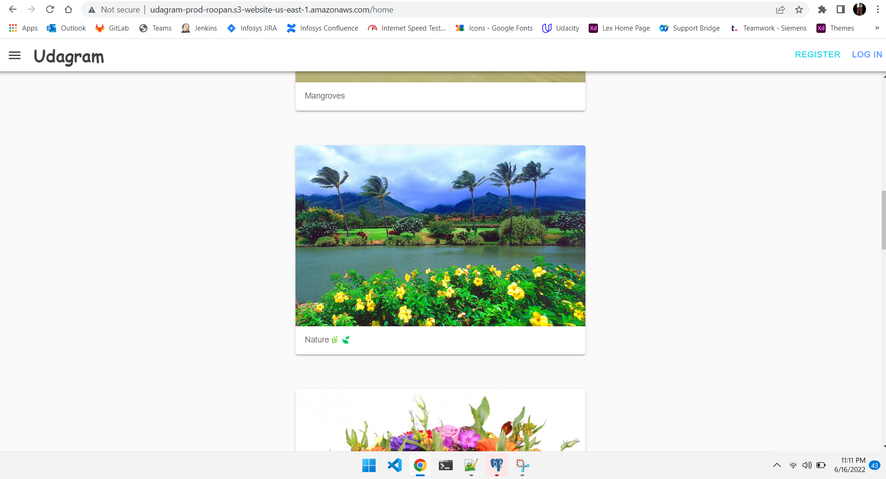

# Udagram [](https://circleci.com/gh/RoopanV/udagram/tree/main)

An Image Filtering application, allows users to register and log into a web client, post photos to the feed, and process photos using an image filtering service. It has two components:

1. Frontend - Angular web application built with Ionic framework
1. Backend RESTful API - Node-Typescript application

### Url to access the application
[http://udagram-prod-roopan.s3-website-us-east-1.amazonaws.com](http://udagram-prod-roopan.s3-website-us-east-1.amazonaws.com)

### Demo Credentials
username: user@demo.com
password: password
### Screenshot of the hosted Application



### Installation

Provision the necessary AWS services needed for running the application:

1. In AWS, provision a publicly available RDS database running Postgres.
1. In AWS, provision a s3 bucket for hosting the uploaded files.
1. Export the ENV variables needed or use a package like [dotnev](https://www.npmjs.com/package/dotenv). `udagram-api` requires following env values.
```
POSTGRES_USERNAME=<username for the postgres db>
POSTGRES_PASSWORD=<password for the postgres db>
POSTGRES_DB=<postgres db name>
PORT=<port to host the backend application>
POSTGRES_HOST=<url of the hosted postgres>
AWS_ACCESS_KEY_ID=<AWS access key id>
AWS_SECRET_ACCESS_KEY=<AWS access key id>
AWS_BUCKET=<bucket name to host>
URL=<Url of the front end application>
JWT_SECRET=<secret for hashing the passwords>
```
1. From the root of the repo, navigate udagram-api folder `cd udagram/udagram-api` to install the node_modules `npm install`. After installation is done start the api in dev mode with `npm run dev`.
1. Without closing the terminal in step 1, navigate to the udagram-frontend `cd udagram/udagram-frontend` to intall the node_modules `npm install`. After installation is done start the api in dev mode with `npm run start`.

## Testing

Follow these steps to run the unit test cases in front end.

1. `cd udagram/udagram-frontend`
1. `npm run test`

There are no Unit test on the back-end

### Unit Tests:

Unit tests are using the Jasmine Framework.

## Built With

- [Angular](https://angular.io/) - Single Page Application Framework
- [Node](https://nodejs.org) - Javascript Runtime
- [Express](https://expressjs.com/) - Javascript API Framework
