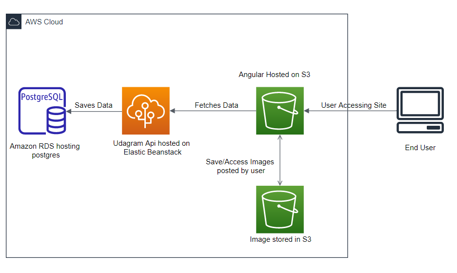
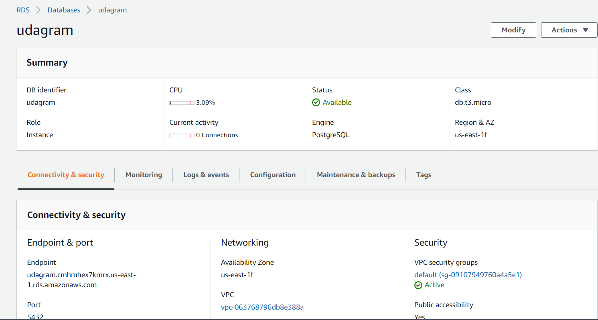
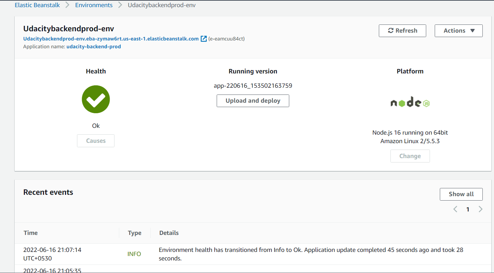
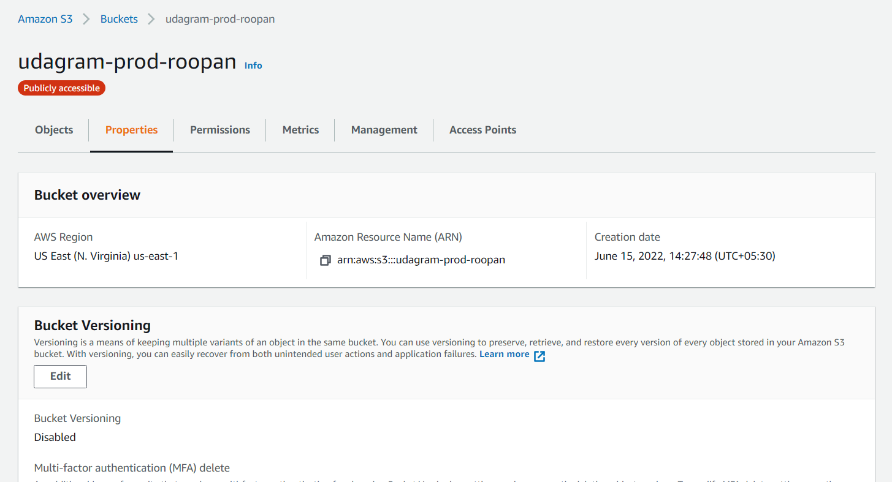
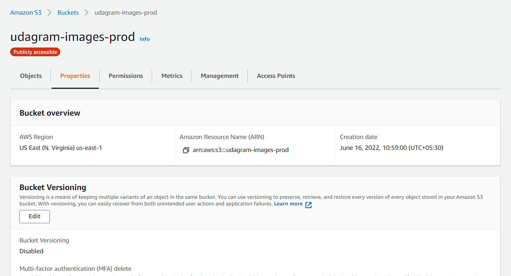

# Architecture

### Highlevel Architecture Overview

### Explanation

1. `udagram-api` and `udagram-frontend` is hosted in AWS Cloud where `udagram-api` in `Elastic Beanstack` and `udagram-frontend` in `S3`.

1. When user tries to access the application `udagram-frontend` files are served from `AWS S3`.

1. `udagram-frontend` gets all the existing feeds from `postgres` through `udagram-api` and shows to user where images are fetched from `S3`

1. When they tries to login/register api calls are made to `udagram-api` in `Elastic Beanstack`.

1. Step 3 inturn connects to `Postgres` which is hosted in `Amazon RDS` to save/retrieve the data. 

1. If the user upload any feeds, `udagram-frontend` get location to store the file in `S3` from `udagram-api` and store the file to `S3`.

1. Once step 5 is completed `udagram-frontend` again call `udagram-api` to save the feed added the user which inturn calls `postgres` to save the data.

---

### AWS RDS Postgres
Postgres database is used to save and retrieve the data of the user handled in the application.

### AWS Elastic Beanstack
`udagram-api` is hosted in AWS Beanstack. It is the central system which handles all the api calls. It validates the signed in user, get and store the feeds, register the user information to database, generates presigned url to store fils AWS S3.

### AWS S3 - Angular
`udagram-frontend`application is hosted here. When any user access our application, the files are served from here.

### AWS S3 - Image
All the images uploaded by user through feeds are saved and served from here.
