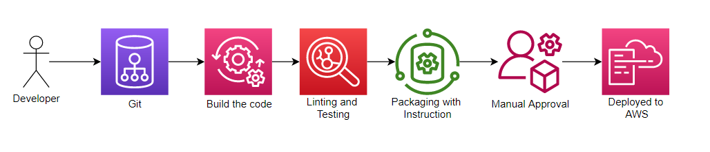
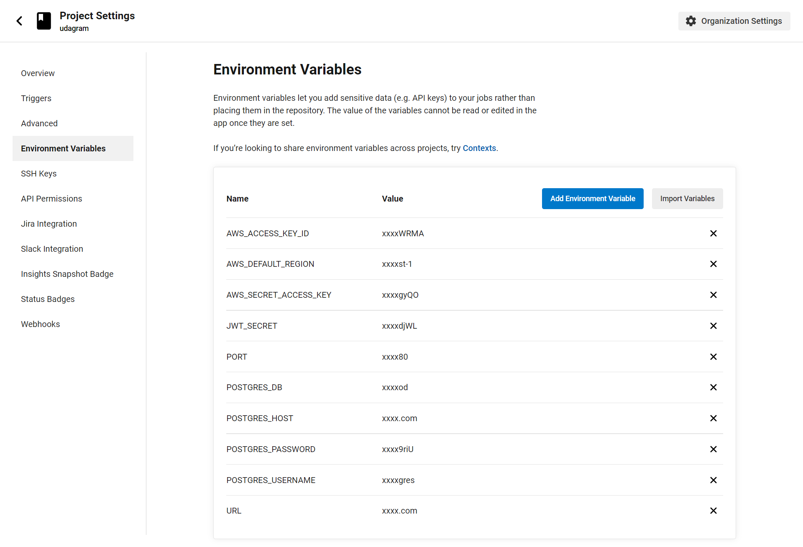
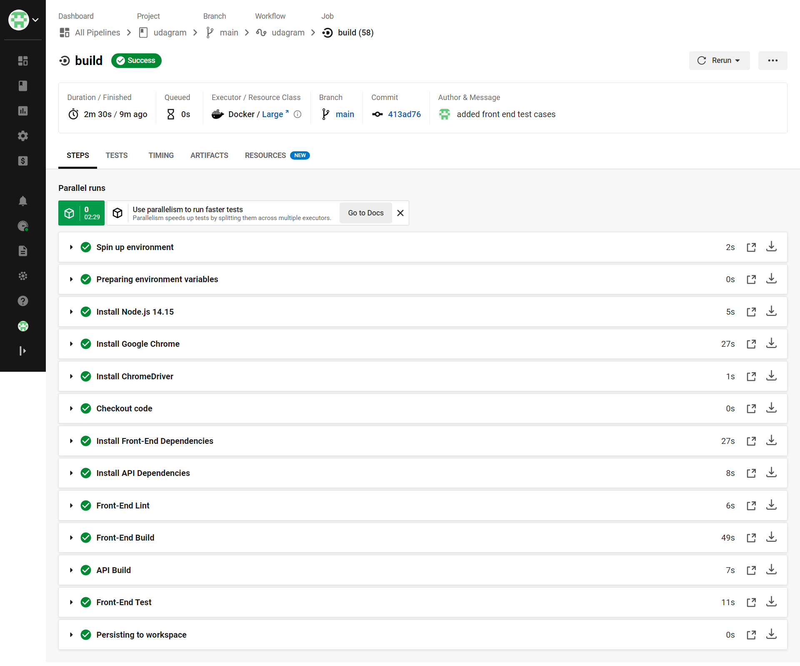
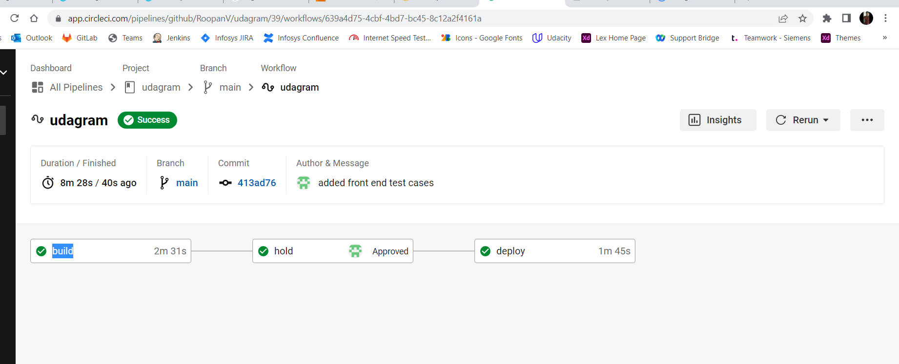
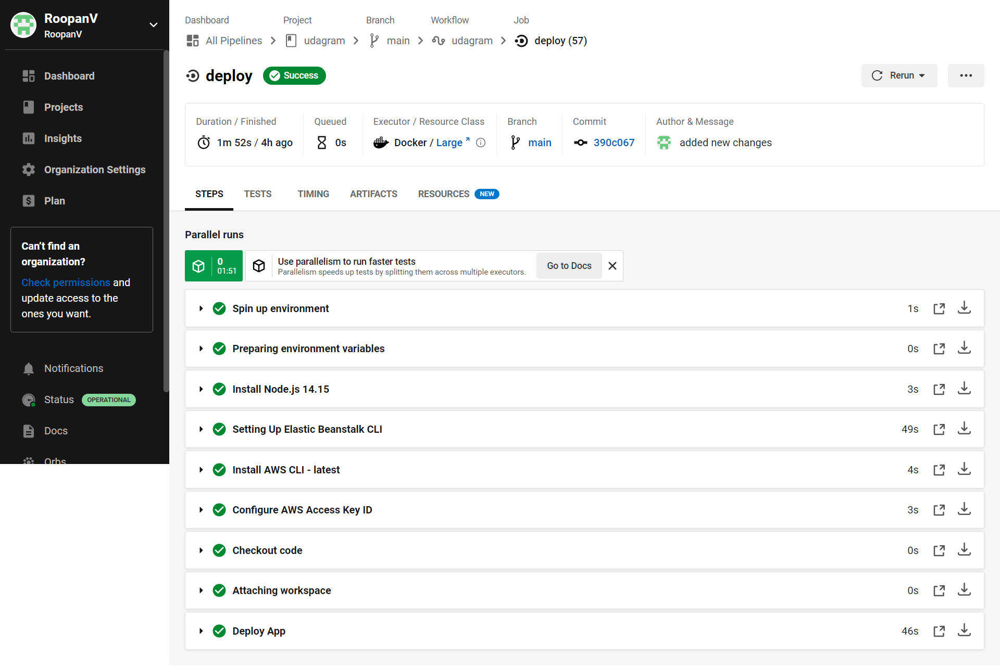

# Pipeline 

CircleCI is used to create pipeline. It is listening on the main branch. Once any push made to main brach pipeline is triggered automatically. It is configured to build, lint, test, wait for approval and deploy the code.

## High level View of Pipeline

### AWS Config
All the required configuration for AWS are passed to the pipeline.

### Stages Involved
1. Build Phase
1. Approval Phase
1. Deploy Phase

## Build Phase
1. Install the dependecies for both `udagram-api` and `udagram-frontend` applications.
1. Check for linting.
1. Builds both the application
1. Run unit test on `udagram-frontend`
1. Preserve the build files so it can be used in next stages.

## Approval Phase
Holds the pipeline until approved manually.

## Deploy Phase
Once approved deploy build files of `udagram-api` and `udagram-frontend` applications to `AWS Elastic Beanstack` and `AWS S3` respectively.  
